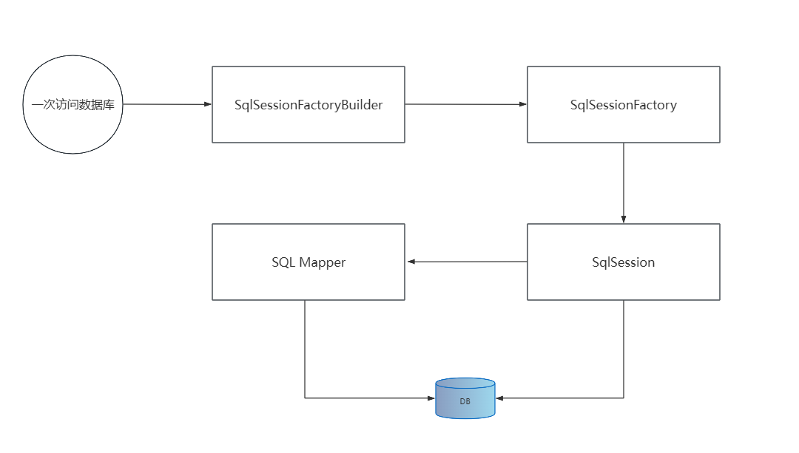

# 从JDBC到MyBatis

```txt
jdbc连接数据库的步骤：
	1.加载数据库驱动；
	2.建立数据库连接
	3.创建Statement或PreparedStatement
	4.执行SQL语句
	5.处理结果集（如果有需要）
	6.关闭连接和释放资源
```

[mysql示例](../main/java/jdbc/JdbcMysql.java) [oracle示例](../main/java/jdbc/JdbcOracle.java)

最简单的来说，==**MyBatis就是对JDBC的流程进行封装**==

==**为什么需要使用MyBatis：**==

```txt
传统JDBC缺陷：
	1.工作量大，操作数据库至少需要6步
	2.业务代码和技术代码耦合
	3.连接资源手动关闭，带来了隐患

ORM带来的好处：
	定义：数据库的表与简单Java对象（POJO）的映射模型，它主要解决数据库和POJO对象的相互映射。
	好处：
		1.更加贴合面向对象的编程语意
		2.技术和业务解耦，无需过多考虑缓存等等，更加专注业务
		3.不用担心资源的释放

MyBatis带来的好处：
	1.几乎可以替换JDBC
	2.高度灵活，想要怎么映射就怎么映射
	3.基于底层SQL的优化能力
	4.学习门槛低，易于维护
	但是，MyBatis相对于Hibernate开发工作量会大一些
	
不用Hibernate的原因：
	1.全表映射带来不便
	2.无法自定义组装SQL
	3.复杂关联关系以及复杂SQL语句支持弱
	4.不支持存储过程
	5.HQL黑盒封装，调优复杂
	6.性能差，不适合大型互联网高性能要求
```

# MyBatis快速开始

1. maven坐标

   ```xml
   				<dependency>
               <groupId>org.mybatis</groupId>
               <artifactId>mybatis</artifactId>
               <version>3.5.2</version>
           </dependency>
   ```

2. [配置文件](../main/resources/quickstart/mybatis-config.xml)

3. [接口](../main/java/quickstart/mapper/UserMapper.java)

4. [测试](../test/java/quickstart/QuickStart.java)

# 一次访问数据库流程

<p>
    
</p>

```txt
SqlSessionFactoryBuilder：读取配置信息创建SqlSessionFactory，建造者模式。方法级别生命周期
SqlSessionFactory：创建SqlSession，工厂单例模式，存在于整个程序生命周期
SqlSession：代表一次数据库连接，可以直接发送SQL执行，也可通过调用Mapper访问数据库；线程不安全，要保证线程独享（方法级）
SQL Mapper：由一个Java接口和Xml文件组成，包含了要执行的SQL语句和结果集规则映射，方法级别生命周期。（这个我感觉不对，在项目中，其实SQL Mapper都是单例了吧。？？？疑问）

MyBatis三要素：
	1.SQL 映射规则 POJO**==
	2.SQL和映射规则主要是mapper接口和对应的xml文件
	3.POJO是实体类
```