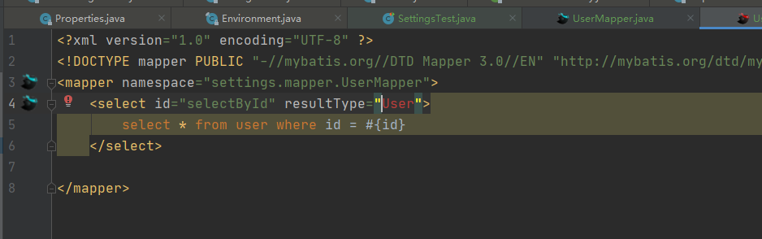

# MyBatis配置


## properties

### 入门

==设置配置项==

基本格式

```xml
<!--
    resource：从项目下的resources目录下开始搜索
    注意：不要写成/settings/db.properties，这样是获取不到配置的
-->
<properties resource="settings/db.properties"/>

或

<!-- url：统一资源定位符 用的少 -->
<properties url="file:///D:/workspace/workspaceideaj/LearnSource/MyBatis/src/main/resources/settings/db.properties"/>
```

<p>
    
</p>

[示例](../main/resources/settings/mybatis-config.xml)

[测试](../test/java/settings/SettingsTest.java)

### 配置顺序

```txt
结论：通过方法参数传递的属性具有最高优先级，resource/url 属性中指定的配置文件次之，最低优先级的则是 properties 元素中指定的属性。
```

[示例](../main/resources/settings/mybatis-config2.xml)

[测试](../test/java/settings/SettingsTest.java)

## settings

会在笔记三介绍

## typeAliases

### 使用

可以给Java类起个别名

将UserMapper中的resultType改为User

<p>
    
</p>

运行[测试](../test/java/settings/SettingsTest.java) 中run03报错

添加配置

```xml
<typeAliases>
    <package name="settings.entity"/>
</typeAliases>

<!-- 
	package以包为单位 
	在实体类上，可以使用@Alias("UserEx") 指定具体的别名。
	如果@Alias没有指明具体的值，则以该类的首字母小写作为类型，User就是user
-->

或

<typeAliases>
    <typeAlias type="settings.entity.User"/>
</typeAliases>

<!-- typeAlias以类为单位 -->
```

运行[测试](../test/java/settings/SettingsTest.java) 中run03通过

注意：别名是==**不区分大小写的**==，例如别名@Alias("UserEx")使用userex也是可以的

### 内建的类型别名

| 别名                      | 映射的类型   |
| ------------------------- | ------------ |
| _byte                     | byte         |
| _char (since 3.5.10)      | char         |
| _character (since 3.5.10) | char         |
| _long                     | long         |
| _short                    | short        |
| _int                      | int          |
| _integer                  | int          |
| _double                   | double       |
| _float                    | float        |
| _boolean                  | boolean      |
| string                    | String       |
| byte                      | Byte         |
| char (since 3.5.10)       | Character    |
| character (since 3.5.10)  | Character    |
| long                      | Long         |
| short                     | Short        |
| int                       | Integer      |
| integer                   | Integer      |
| double                    | Double       |
| float                     | Float        |
| boolean                   | Boolean      |
| date                      | Date         |
| decimal                   | BigDecimal   |
| bigdecimal                | BigDecimal   |
| biginteger                | BigInteger   |
| object                    | Object       |
| date[]                    | Date[]       |
| decimal[]                 | BigDecimal[] |
| bigdecimal[]              | BigDecimal[] |
| biginteger[]              | BigInteger[] |
| object[]                  | Object[]     |
| map                       | Map          |
| hashmap                   | HashMap      |
| list                      | List         |
| arraylist                 | ArrayList    |
| collection                | Collection   |
| iterator                  | Iterator     |

## TypeHandle

### 基本使用

```txt
通过类型处理器的泛型，MyBatis 可以得知该类型处理器处理的 Java 类型，不过这种行为可以通过两种方法改变：
	1.在类型处理器的配置元素（typeHandler 元素）上增加一个 javaType 属性（比如：javaType="String"）；
	2.在类型处理器的类上增加一个 @MappedTypes 注解指定与其关联的 Java 类型列表。 如果在 javaType 属性中也同时指定，则注解上的配置将被忽略。
可以通过两种方式来指定关联的 JDBC 类型：
	1.在类型处理器的配置元素上增加一个 jdbcType 属性（比如：jdbcType="VARCHAR"）；
	2.在类型处理器的类上增加一个 @MappedJdbcTypes 注解指定与其关联的 JDBC 类型列表。 如果在 jdbcType 属性中也同时指定，则注解上的配置将被忽略。	
```

[示例](../main/resources/settings/mybatis-config3.xml)

[测试](../test/java/settings/SettingsTest.java)

当在 `ResultMap` 中决定使用哪种类型处理器时，此时 Java 类型是已知的（从结果类型中获得），但是 JDBC 类型是未知的。 因此 Mybatis 使用 `javaType=[Java 类型], jdbcType=null` 的组合来选择一个类型处理器。 这意味着使用 `@MappedJdbcTypes` 注解可以*限制*类型处理器的作用范围，并且可以确保，除非显式地设置，否则类型处理器在 `ResultMap` 中将不会生效。 如果希望能在 `ResultMap` 中隐式地使用类型处理器，那么设置 `@MappedJdbcTypes` 注解的 `includeNullJdbcType=true` 即可。 然而从 Mybatis 3.4.0 开始，如果某个 Java 类型**只有一个**注册的类型处理器，即使没有设置 `includeNullJdbcType=true`，那么这个类型处理器也会是 `ResultMap` 使用 Java 类型时的默认处理器。

注意：

```xml
1.多个JavaType JdbcType类型处理器，看配置，谁最后配置，取谁的。

2.JavaType JdbcType设置优先级
<typeHandler handler="settings.typehandle.TypeHandleForMailSplit2" jdbcType="VARCHAR" javaType="Email"/>

extends BaseTypeHandler<Email>
  

@MappedJdbcTypes(JdbcType.INTEGER)
@MappedTypes({String.class})
  
三者优先级如下
```

<p>
    
</p>

### 处理枚举类型

MyBatis可以处理枚举类型，自带两种方式，也可以自定义TypeHandle。合计三种方式，自定义handle不在过多赘述。

**方式一：**

`org.apache.ibatis.type.EnumTypeHandler`

默认的，无需在配置文件手动添加。处理方式为在数据库存枚举类的名字。[例如](../main/java/settings/enumpojo/Source.java)中的LOGIN，EXPORT，HADN等。

[示例](../main/resources/settings/mybatis-config4.xml)

[测试](../test/java/settings/SettingsTest.java)中的run05

方式二：

手动引入

```xml
<typeHandlers>
    <typeHandler handler="org.apache.ibatis.type.EnumOrdinalTypeHandler" javaType="settings.enumpojo.Source"/>
</typeHandlers>
```

[测试](../test/java/settings/SettingsTest.java)中的run06，存的是序号，此时存的是2，也就是每个枚举对应的序号

**注意**：如果选择了手动引入，还想存名字（方式一）。那么需要手动指定处理器。

```xml
select:
<result column="source" property="source"  typeHandler="org.apache.ibatis.type.EnumTypeHandler"/>
insert:
#{handleEnum.source,typeHandler=org.apache.ibatis.type.EnumTypeHandler}
```

**不建议使用方式二**：按照

```java
LOGIN(1,"注册"),
EXPORT(2,"导入"),
HADN(3,"手动添加");
```

的方式，存注册为0，存导入为1，存手动添加为3。

[测试](../test/java/settings/SettingsTest.java)中的run06

如果此时存了2，但是有人修改了java 枚举类中的顺序，就会产生问题。

```java
LOGIN(1,"注册"),
HADN(3,"手动添加"),
EXPORT(2,"导入");
```

此时数据库存的2，查询出来对应的枚举类变成了`EXPORT(2,"导入")`。这是不符合预期的。真实开发环境中，都使用码值，也就是枚举类中的code值，code值一般是不会随意变化的。

## objectFactory

每次 MyBatis 创建结果对象的新实例时，它都会使用一个对象工厂（ObjectFactory）实例来完成实例化工作。 默认的对象工厂需要做的仅仅是实例化目标类，要么通过默认无参构造方法，要么通过存在的参数映射来调用带有参数的构造方法。 如果想覆盖对象工厂的默认行为，可以通过创建自己的对象工厂来实现

继承`extends DefaultObjectFactory`来实现

主要实现三个方法：

```java
create(Class<T> type)
create(Class<T> type, List<Class<?>> constructorArgTypes, List<Object> constructorArgs)
setProperties(Properties properties)
```

[例如](../main/java/settings/objectfactory/ExampleObjectFactory.java)

[示例](../main/resources/settings/mybatis-config5.xml)

[测试](../test/java/settings/SettingsTest.java)中的run07

其中`setProperties(Properties properties)`中的参数配置来自配置文件的`property`。

```xml
<objectFactory type="settings.objectfactory.ExampleObjectFactory">
    <property name="aaaaaaaaaaa" value="100000000000"/>
</objectFactory>
```

这个属性配置暂时不知道什么作用，看源码的时候需要注意。

## plugins

暂不研究，插件开发的时候研究

## environments

暂不研究，一般数据源都交给`spring`管理了，等集成`spring`在看看

## databaseIdProvider

暂不研究，一般数据源都交给`spring`管理了，等集成`spring`在看看