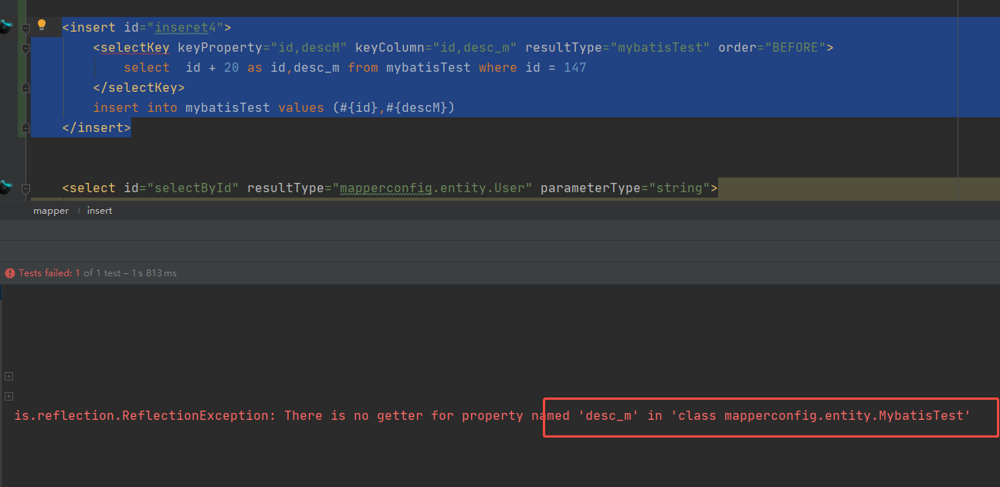

# Mapper配置

## select

查询数据库的元素

### id

官方定义：在命名空间中唯一的标识符，可以被用来引用这条语句。

就是在mapper文件中的方法名。

例如：

```java
<select id="selectById" resultType="mapperconfig.entity.User" parameterType="string">
   select * from user where id = #{id}
</select>
```

其实就是

```java
User selectById(@Param("id") String id);
```

[示例](../main/java/mapperconfig/mapper/UserMapper.java) 中的 方法名字 （selectById），[对应](../main/resources/mapperconfig/mapper/UserMapper.xml)selectById的id属性（selectById）。

[测试](../test/java/mapperconfig/MapperConfigTest.java)中的run01

### parameterType

传入参数的类型

[示例](../main/java/mapperconfig/mapper/UserMapper.java) 中的 selectByDTO和selectByDTOUseParamType ，[对应](../main/resources/mapperconfig/mapper/UserMapper.xml)中配置，一个我加了`parameterType="QueryUserDTO"`一个我没加，其实对于结果来说，并没有什么影响。

[测试](../test/java/mapperconfig/MapperConfigTest.java)中的run02

如果在interface中**加了**`@Param("xxx")`，那么在`#{xx}`的时候，如果传进来是实体类，那么需要`#{xx.xx}`，非实体类则直接`#{xx}`即可。

如果在interface中**不加**`@Param("xxx")`，如果传进来的是实体类，可以直接`#{xx}`其中的属性即可。非实体类直接`#{xx}`即可。

如果**不加**`@Param("xxx")`，那么MyBatis默认的参数名字为`[arg1, arg0, param1, param2]` map的时候好像是没有这个默认的参数名字的，map直接用key就行了（不加@Param的时候）。

### resultMap

对元素`resultMap` 的命名引用

注意：` resultType 和 resultMap 之间只能同时使用一个`。

### resultType

期望从这条语句中返回结果的类全限定名或别名。 注意，如果返回的是集合，那应该设置为集合包含的类型，而不是集合本身的类型。

[示例](../main/java/mapperconfig/mapper/UserMapper.java) 中的 方法`selectById`设置为`resultType="mapperconfig.entity.User"`。这是查询一个。

[示例](../main/java/mapperconfig/mapper/UserMapper.java) 中的 方法`selectByDTO`设置为`resultType="mapperconfig.entity.User"`。这是查询多个。

查询一个和查询多个其实都是一样的逻辑，放返回的实体对象，而非集合本身。而是集合里面包含的元素的类型即可。

注意：` resultType 和 resultMap 之间只能同时使用一个`。

### 总结

#### **自动映射**

- 前提：SQL列名和JavaBean的属性是一致的；

- 自动映射等级autoMappingBehavior设置为PARTIAL，需要谨慎使用FULL；

- 使用resultType；

- 如果列名和JavaBean不一致，但列名符合单词下划线分割，Java是驼峰命名法，

  则mapUnderscoreToCamelCase可设置为true；

#### 传递多个查询入参

- 使用map传递参数；可读性差，导致可维护性和可扩展性差，杜绝使用；

- 使用注解传递参数；直观明了，当参数较少一般小于5个的时候，建议使用；

- 使用Java Bean的方式传递参数；当参数大于5个的时候，建议使用；

  [测试](../test/java/mapperconfig/MapperConfigTest.java)中的run03

## resultMap

结果集映射

### constructor

用于在实例化类时，注入结果到构造方法中。简单来说，如果你不写的话，就默认使用无参构造。

```xml
<resultMap id="BaseResultMap" type="mapperconfig.entity.User">
   <constructor>
      <idArg column="id" javaType="string"/>
      <arg column="mail" javaType="string"/>
   </constructor>
</resultMap>
```

```java
public User(String id, String mail) {
    this.id = id;
    this.mail = mail;
}
```

[示例](../main/java/mapperconfig/mapper/UserMapper.java) 中的selectByIdUserResultMapArg

[测试](../test/java/mapperconfig/MapperConfigTest.java)中的run04

其中，idArg必须是第一个。我一般都用来在主键上使用。

如果修改下位置，那么

```xml
<resultMap id="BaseResultMap2" type="mapperconfig.entity.User">
   <constructor>
      <arg column="mail" javaType="string"/>
      <arg column="id" javaType="string"/>
   </constructor>
</resultMap>
```

mail的值将会对应到bean的id上去。也就是说，**必须按照构造函数的顺序来一一书写**

如果想改顺序，可以参考以下代码：

```xml
<resultMap id="BaseResultMap3" type="mapperconfig.entity.User">
   <constructor>
      <arg column="mail" name="mail"/>
      <arg column="id" name="id"/>
   </constructor>
</resultMap>
```

```java
public User(@Param("id") String id, @Param("mail") String mail) {
    this.id = id;
    this.mail = mail;
}
```

注意：

- `name`，`@Param(xx)`和`String xx`三者必须一样（本地测出来），因此并不需要改名的功能。
- 没有在`constructor`中体现的属性，其规则和普通的 id 和 result 元素是一样的。

### id

sql中的字段和bean中属性做映射使用（一般用在主键上），官方说可以提升性能，我暂时不清楚。

```xml
<id column="name" property="name" />

column：sql中的字段名
property：bean中的属性名
typeHandler：类型转换器
javaType：bean属性类型
jdbcType：sql中的字段类型
```

### result

sql中的字段和bean中属性做映射使用（一般用在非主键上）

```xml
<result column="type" property="type"/>

column：sql中的字段名
property：bean中的属性名
typeHandler：类型转换器
javaType：bean属性类型
jdbcType：sql中的字段类型
```

并不需要把所有的映射关系全部写出来，没有写的将做自动映射。但是推荐写，因为这样bean和mapper文件解耦。

## insert, update 和 delete

### id

官方定义：在命名空间中唯一的标识符，可以被用来引用这条语句。

就是在mapper文件中的方法名。

### parameterType

传入参数的类型

### useGeneratedKeys和keyProperty

useGeneratedKeys:（仅适用于 insert 和 update）这会令 MyBatis 使用 JDBC 的 getGeneratedKeys 方法来取出由数据库内部生成的主键

keyProperty:（仅适用于 insert 和 update）指定能够唯一识别对象的属性，MyBatis 会使用 getGeneratedKeys 的返回值或 insert 语句的 selectKey 子元素设置它的值。insert 语句的 selectKey 子元素设置keyProperty是在子元素上设置

[示例](../main/java/mapperconfig/mapper/UserMapper.java) 中的inseret0和inseret1

[测试](../test/java/mapperconfig/MapperConfigTest.java)中的run05和run06

### selectKey

`selectKey`的用法看[示例](../main/java/mapperconfig/mapper/UserMapper.java) 中的inseret3，其属性order="BEFORE"看情况，我本地MySql是BEFORE，具体是BEFORE还是AFTER看数据库执行语句和回填结果。我觉得Mysql是BEFORE，Oracle是AFTER。官方解释：可以设置为 `BEFORE` 或 `AFTER`。如果设置为 `BEFORE`，那么它首先会生成主键，设置 `keyProperty` 再执行插入语句。如果设置为 `AFTER`，那么先执行插入语句，然后是 `selectKey` 中的语句 - 这和 Oracle 数据库的行为相似，在插入语句内部可能有嵌入索引调用。

[测试](../test/java/mapperconfig/MapperConfigTest.java)中的run07

看[示例](../main/java/mapperconfig/mapper/UserMapper.java) 中的inseret4。如果是多个字段，经过测试，设计的比较怪，`keyColumn`，`keyProperty`，`sql中的字段名字`三者必须要一致。一方不一样都报错。例如：

```xml
<insert id="inseret4">
   <selectKey keyProperty="id,descM" keyColumn="id,desc_m" resultType="mybatisTest" order="BEFORE">
      select  id + 20 as id,desc_m from mybatisTest where id = 147
   </selectKey>
   insert into mybatisTest values (#{id},#{descM})
</insert>
```

<p>
    
</p>

按照字段解释来说keyColumn对应sql中的字段，keyProperty代表实体中的属性名。但是实际上这种改法会报错。并且resultType="mybatisTest"必须和inseret4传参一直，不然还是报错。这也就意味着，实际上在执行`selectKey`后，会把生成的`id,descM`回填到同一个对象中。(我尝试新建了类`MybatisTest2`修改参数去验证，都是错误的)

[测试](../test/java/mapperconfig/MapperConfigTest.java)中的run08

## sql

用来定义可重用的 SQL 代码段，可以包含在其他语句中

```xml
<sql id="baseColumn">
   id, name, nikename, psw, status, mail, phone, type, register_time, login_time, last_login_time, login_count, bind_postion, salt, source
</sql>
```

```xml
<select id="selectByIdUserResultMapArg" resultMap="BaseResultMap4" parameterType="string">
   select <include refid="baseColumn" /> from user where id = #{id}
</select>
```

## \#{}和${}

预编译 #{}：将传入的数据都当成一个字符串，会对自动传入的数据加一个双引号，能够很大程度防止

sql注入；

传值 ${}：传入的数据直接显示生成在sql中，无法防止sql注入；

表名、选取的列是动态的，order by和in操作， 可以考虑使用$

[示例](../main/java/mapperconfig/mapper/UserMapper.java) 中的selectDyError和selectDy

[测试](../test/java/mapperconfig/MapperConfigTest.java)中的run09

## 动态sql

`if`：判断语句，单条件分支判断

`choose、when、otherwise`：多条件分支判断

`trim、where、set`：用于处理sql拼装问题

`foreach`：循环语句，在in语句等列举条件常用，常用于实现批量操作


```xml
<select id="selectByCondition" resultType="mapperconfig.entity.User">
   select * from user
   where 1 = 1
   <if test="name != null and name != '' ">
      and name like concat('%',#{name},'%')
   </if>
   <if test="name != null and name != '' ">
      and mail like concat('%',#{mail},'%')
   </if>
</select>
```

代码中，判断了name和mail的拼接条件。

但是如果name和mail都没传。那么sql就变成了

```sql
select * from user where 
```

这是不对的，这个时候需要配合`where`元素使用。

```xml
<select id="selectByCondition2" resultType="mapperconfig.entity.User">
   select * from user
   <where>
      <if test="name != null and name != '' ">
         and name like concat('%',#{name},'%')
      </if>
      <if test="mail != null and mail != '' ">
         and mail like concat('%',#{mail},'%')
      </if>
   </where>
</select>
```

若子句的开头为 `AND 或 OR`，`where` 元素也会将它们去除。

实际上，`where`等价于

```xml
<select id="selectByCondition3" resultType="mapperconfig.entity.User">
   select * from user
   <trim prefixOverrides="AND | OR" prefix="where">
      <if test="name != null and name != '' ">
         and name like concat('%',#{name},'%')
      </if>
      <if test="mail != null and mail != '' ">
         and mail like concat('%',#{mail},'%')
      </if>
   </trim>
</select>
```

[测试](../test/java/mapperconfig/MapperConfigTest.java)中的run10


在看看`set`

```xml
<update id="updateNameAndEmail">

   update user set
   <if test="name != null and name != ''">
      name = #{name},
   </if>
   <if test="mail != null and mail != ''">
      mail = #{mail}
   </if>
   where id = #{id}

</update>
```

如果不传mail，语句就变成了

```sql
update user set name = ?, where id = ?
```

不符合sql。

此时，换成`set`元素。

```xml
<update id="updateNameAndEmail1">

   update user
   <set>
      <if test="name != null and name != ''">
         name = #{name},
      </if>
      <if test="mail != null and mail != ''">
         mail = #{mail}
      </if>
   </set>
   where id = #{id}

</update>
```

`set`等价于

```xml
<update id="updateNameAndEmail2">

   update user
   <trim prefix="set" suffixOverrides=",">
      <if test="name != null and name != ''">
         name = #{name},
      </if>
      <if test="mail != null and mail != ''">
         mail = #{mail}
      </if>
   </trim>
   where id = #{id}

</update>
```

[测试](../test/java/mapperconfig/MapperConfigTest.java)中的run11


看下`foreach`

```xml
<insert id="insertForeach">
   insert into mybatistest values
   <foreach collection="list" separator="," item="testInfo">
      (
         #{testInfo.id},
         #{testInfo.descM}
      )
   </foreach>
</insert>
```

[测试](../test/java/mapperconfig/MapperConfigTest.java)中的run12

这里设计到一个点：`批量操作`

在Mybatis中除了`foreach`可以批量操作，还有一种`BATCH`的方式

```java
SqlSession sqlSession = sqlSessionFactory.openSession(ExecutorType.BATCH,true);
```

[测试](../test/java/mapperconfig/MapperConfigTest.java)中的run13

这里，虽然事物是自动提交，但是对于BATCH方式，仍然需要手动提交。


最后，看下`choose、when、otherwise`类似Java中的`switch case`

```xml
<select id="selectByCondition4" resultType="mapperconfig.entity.User">
   select * from user
   <trim prefixOverrides="AND | OR" prefix="where">
      <choose>
         <when test="name == 'ly'">
            and name like concat('%lll',#{name},'lll%')
         </when>
         <when test="name == 'qy'">
            and name like concat('%qqq',#{name},'qqq%')
         </when>
         <otherwise>
            and name like concat('%',#{name},'%')
         </otherwise>
      </choose>
   </trim>
</select>
```

[测试](../test/java/mapperconfig/MapperConfigTest.java)中的run14